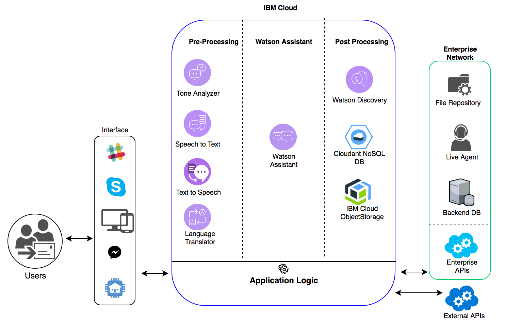

# [MyChatBot](https://my-watson-assistant.mybluemix.net) - IBM Watson Assistant with Discovery Service


**This application shows the capabilities of Watson [Assistant](https://console.bluemix.net/docs/services/conversation/index.html#about) and [Discovery](https://console.bluemix.net/docs/services/discovery/index.html) services to work together to find answers on a given query. In this sample app, the user is chatting with a virtual car dashboard, giving it commands in plain English such as "Turn on the wipers," "Play me some music," or "Let's find some food." If the user makes a request and Watson Assistant is not confident in its answer (e.g. "How do I check my tire pressure?"), Discovery will search the car manual and return the most relevant results, if relevant materials exist.**

## Table of Contents
* [How it Works](#how-it-works)
* [Run Locally](#run-locally)
  * [Getting Started](#getting-started)
  * [Setting up Services](#setting-up-services)
  * [Train Watson Services](#train-watson-services)
  * [Running the App](#running-the-app)
  * [Testing the app] (#testing-the-app)
  * [Channels Integration] (#channels-integration)
* [License](#license)

## How it Works

Under the hood, there are two components to this app:
* One is the front-end (Angular 5 based), which is simply static assets (HTML, CSS and JS etc.)
* The other is the nodejs (Loopback framework) based server side logic:
  * When the user inputs text, the UI sends the current context and input to the server. These are processed by Watson Assistant service and returned, with an output and new context. The results are sent to the next action.
  * The Discovery action checks for a flag from the Assistant output, and if it is present takes the original input and queries the manual with it. If there is no flag, the Assistant results pass through the function unchanged. The Server returns the output and updated context back to the UI.
  * You can enable/disable Watson Discovery service by configuring it in .env files
  * If you want a response to be saved in Cloudant DB, then just add following context variable to Watson Assistant request:
  ```
  "context": {
    "save_in_db": true
  }
  ```

Below diagram shows the overall architecture of a complete solution that uses Watson Assistant:

<!--  -->

<p align="center">
  
</p>


## Run Locally

### Getting Started (Backend/Server side)
1. If you don't already have an IBM Cloud account, you can sign up [here](https://console.bluemix.net/?cm_mmc=GitHubReadMe)
> First of all create a Cloudfoundry applicaiton on IBM Cloud.  Create a Node JS starter application (Catalog -> Cloud Foundry apps -> SDK for Node JS), and bind following services to it:
  - CloudantNoSQL DB
  - Watson Assistant
  - Watson Discovery (Optional)
  - Object storage (Optional): Create an instance of Object storage of the type “Object Storage OpenStack Swift”
  Note: By default object storage instance of the type “Cloud Object Storage” would get created. To create object storage of required type, after selecting Object Storage instance from the catalog, one need to click on “Compare Versions” button on top right, and select “Object Storage OpenStack Swift” and then click on “Create” to create the service instance.

2. Clone (or fork) this repository, and go to the new directory
```bash
git clone https://git.ng.bluemix.net/gurvsin3/my-watson-assistant.git
cd my-watson-assitant
```

3. Install [Node.js](https://nodejs.org) (Versions >= 8).

4. In the root directory of your repository, install the project dependencies.
```bash
npm install
```

#### Issues running on Windows Machine
There are a few issues you may face while trying to run the application on a Windows machine:
  - Issue related to node-gyp rebuild, “The build tools for v141 (Platform tools) not found” error
    Resolution: Run following command to install windows build tools.

    ```bash
    npm install --global --production windows-build-tools
    ```

  - dezalgo ENOENT npm install error
    Resolution: npm can be upgraded by running the following command

    ```bash
    npm i -g npm
    ```

  - Fatal error LNK1181: cannot open input file c:\OpenSSL-Win64\lib\libeay32.lib
    Resolution: Install OpenSSL in default path, after which the required lib file will be in place. https://www.openssl.org/

### Setting local environment

1. After restaging the application on IBM Cloud, open the app dashboard. Go to Runtime side menu -> click on “Environment Variables” tab and copy the contents of VCAP_SERVICES into 'credentials.json' file and place the same in “my-watson-assistant” root directory.

The format of that file should be like below:

```
{
  "conversation": [
                    {"credentials": {
                                        "url": "https://gateway.watsonplatform.net/conversation/api",
                                        "username": "2c588798-50fb-4c2b-82fc-124434aafff",
                                        "password": "432VSFdsdfs3"
                                    }
                    }
                ],
  "discovery": [
                  {
                    "credentials": {
                                        "url": "https://gateway.watsonplatform.net/discovery/api",
                                        "username": "asdd233f-f3b9-4a27-af40-f34243sdfs4sdf",
                                        "password": "234ddf4sdfs"
                                   }
                  }
              ]
}

```

2. Copy the contents of .env.example file in root directory to .env file and replace the values for each property as per your application requirement


### Getting Started (Client side)

This project was generated with [Angular CLI](https://github.com/angular/angular-cli) version 1.1.3.

### Client side build (Using Angular 5)

```bash
cd client
npm install
```

> Make sure you make the changes under the "environments" folder as per your application created on IBM Cloud (specially in environment.prod.ts file).  This will be used once you deploy the app to IBM Cloud

### Development server

Run `ng serve` for a dev server. Navigate to `http://localhost:4200/`. The app will automatically reload if you change any of the source files.

### Code scaffolding

Run `ng generate component component-name` to generate a new component. You can also use `ng generate directive|pipe|service|class|module`.


### Train Watson Services
Run following commands to train Conversation and Discovery services:
``` bash
  npm run train
```

### Running the App
1. Install the demo app package into the local Node.js runtime environment:

    ```bash
    npm install
    ```

2. Start the server side app (NodeJs - Loopback framework based):

    ```bash
    npm start
    ```
    Now your server side application should be running on port 3000 (http://localhost:3000)

3. In new terminal tab, install Client build dependencies

  ```bash
  cd client
  npm install
  ```
4. Run the Client side build (Angular framework)

  ```bash
  ng serve
  ```
  Now static build should be running on port 4200 (http://localhost:4200)

5. Point your browser to http://localhost:4200 to try out the app.

## Testing the app

After your app is installed and running, experiment with it to see how it responds.

The chat interface is on the left, and the JSON that the JavaScript code receives from the Conversation service is on the right. Your questions and commands are interpreted using a small set of sample data trained with the following intents:

    turn_on
    turn_off
    turn_up
    turn_down
    traffic_update
    locate_amenity
    weather
    phone
    capabilities
    greetings
    goodbyes

Type a request, such as `music on` or `I want to turn on the windshield wipers`. The system understands your intent and responds. You can see the details of how your input was understood by examining the JSON data in the `Watson understands` section on the right side.

For example, if you type `Turn on some music`, the JSON data shows that the system understood the `turn_on` intent with a high level of confidence, along with the `appliance` entity with a value of `music`.

In addition to conversational commands, you can also ask questions that you would expect to have answered in your car manual. For example:

    How do I check my tire pressure
    How do I turn on cruise control
    How do I improve fuel efficiency
    How do I connect my phone to bluetooth

## Channels Integration

This repository currently has integrations with Slack and Microsoft Bot Framework (Skype).
Slack integration can be enabled by setting the following environment variables:

```
ENABLE_SLACK=true
SLACK_BOT_USER_TOKEN=<REPLACE_WITH_SLACK_BOT_USER_TOKEN>

```
MS Bot / Skype integration can be enabled by setting the following environment variables:

```
ENABLE_MS_BOT=true
MS_BOT_APP_ID=<REPLACE_WITH_MS_BOT_APP_ID>
MS_BOT_APP_PASSWORD=<REPLACE_WITH_MS_BOT_APP_PASSWORD>

```
More details on this and how to add other Bot integrations can be found [here] (https://botkit.ai/getstarted.html)

## License

This sample code is licensed under Apache 2.0.
Full license text is available in [LICENSE](LICENSE).

## Reference

- [IBM_sign_up](http://bluemix.net/registration)
- [cf_docs](https://www.ibm.com/watson/developercloud/doc/common/getting-started-cf.html)
- [cloud_foundry](https://github.com/cloudfoundry/cli#downloads)
- [watson_assistant_docs](http://www.ibm.com/watson/developercloud/doc/conversation/overview.shtml)
- [node_link](http://nodejs.org/)
- [npm_link](https://www.npmjs.com/)
- [channels_integration](https://botkit.ai/getstarted.html)
